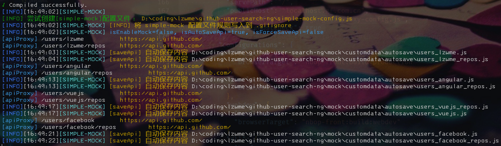

# Github-User-Search For Angular Demo

这是一个基于 Angular 7 和 Github API 实现的 Github 用户搜索应用示例。

基于 [simple mock](https://github.com/lzwme/simple-mock) 和 `Angular-CLI` 实现简单的 API Mock 模拟功能。

## 开发

clone 本项目

```bash
npm run bootstrap
npm start
# or
start ./dev-start.bat
```



## More Links

- [在 Angular-cli 中引入 simple-mock 实现前端开发 API Mock 接口数据模拟](https://lzw.me/a/angular-cli-simple-mock.html)
- [live demo](https://lzw.me/pages/demo/github-user-search-ng/)
- [https://developer.github.com/v3/guides/basics-of-authentication/#registering-your-app](https://developer.github.com/v3/guides/basics-of-authentication/#registering-your-app)
- [https://github.com/renxia/github-user-search-ng](https://github.com/renxia/github-user-search-ng)
- [https://github.com/renxia/github-user-search-vue](https://github.com/renxia/github-user-search-vue)

# License

MIT.
